# hse_hw3_chromhmm

### Данные

Моя клеточная линия из дз №2 не подошла, так как было меньше 10 файлов, поэтому я взял **HepG2** и следующие гистоновые модификации: H2az, H3k27ac, H3k27me3, H3k36me3, H3k4me1, H3k4me2, H3k4me3, H3k79me2, H3k9ac, H3k09me3.

Все вычисления проводились в Google Colab: **https://colab.research.google.com/drive/1rB137sMddD1jff28qcZXAq9XwDM17p48?usp=sharing**

### ChromHMM

|  | | 
| ------------- | ------------- |
| 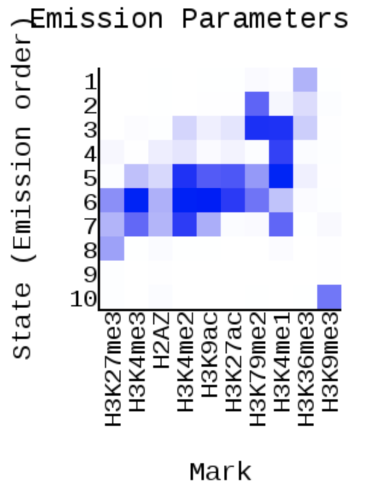 | 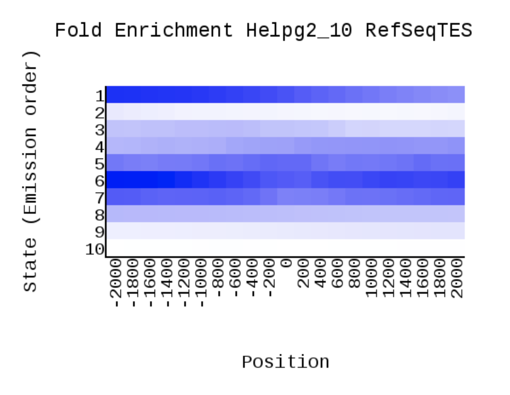 | 
| 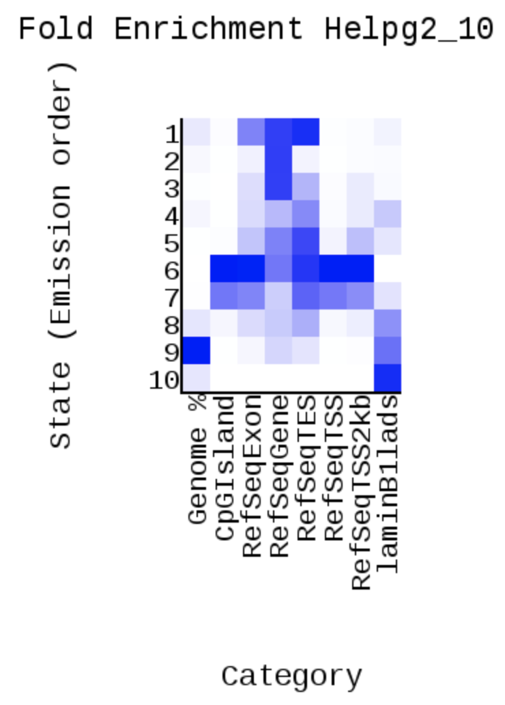 | 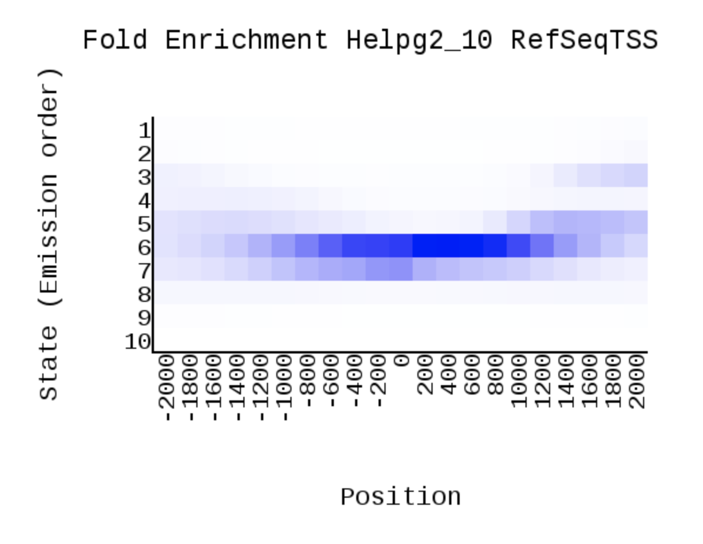 |
| 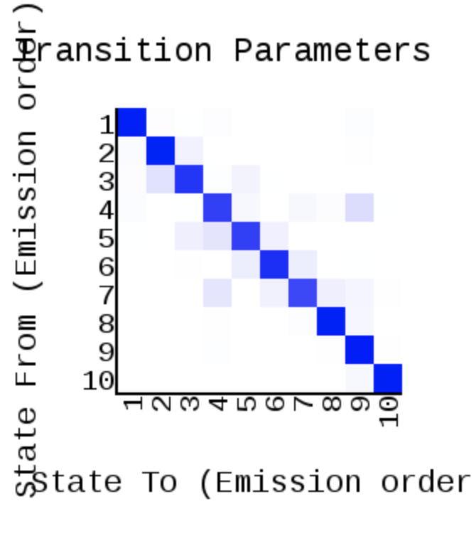 |  | 

### Геномный браузер и рассуждения 

|  | | 
| ------------- | ------------- |
| Заметим, что 4 всегда идет после 9. К тому же очень часто с 4 начинается ген, поэтому стоит предположить, что **4 - промоутер**, а **9 - энхансер**.| 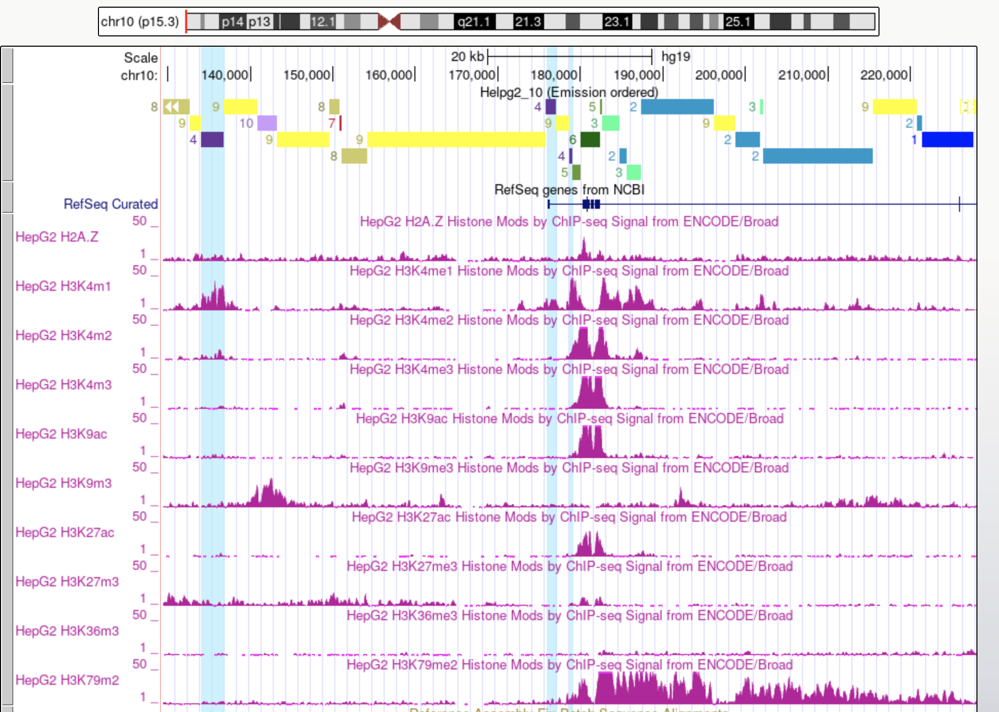 | 
| 7 чаще всего встречается c гистоновыми метками H3k04me1 и H3k4me2. H3k04me1 ассоциируется с энхансерами, поэтому **7 - энхансер**. Так же можно сказать, что  **8 - кодирующая последовательность**.| 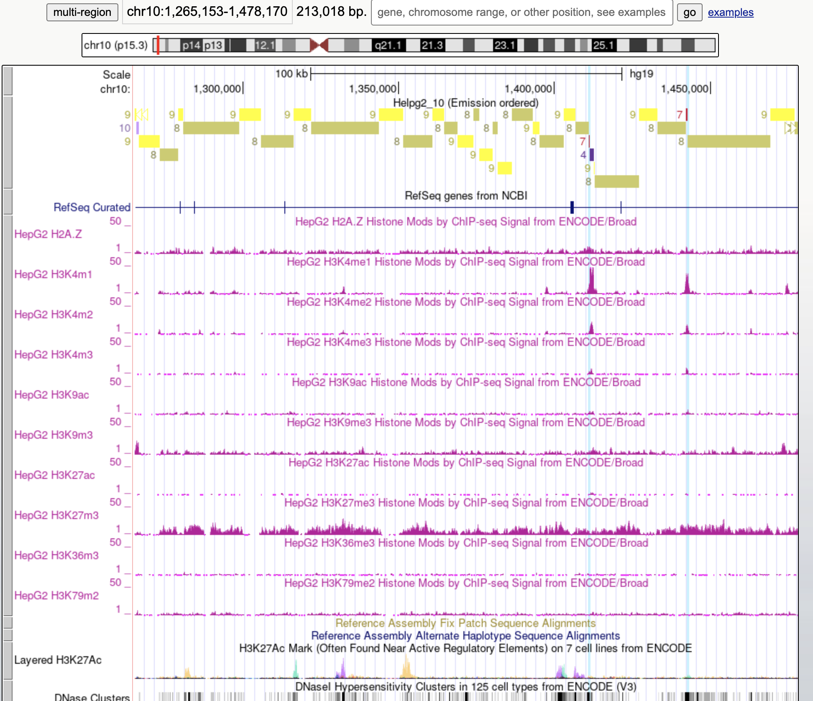 |
| 10 встречается крайне редки и больше всего ассоциирован с H3k09me3. В свою очередь эта гистоновая метка ассоциируется с гетерохроматином. Поэтому **10 - гетерохроматин**. |  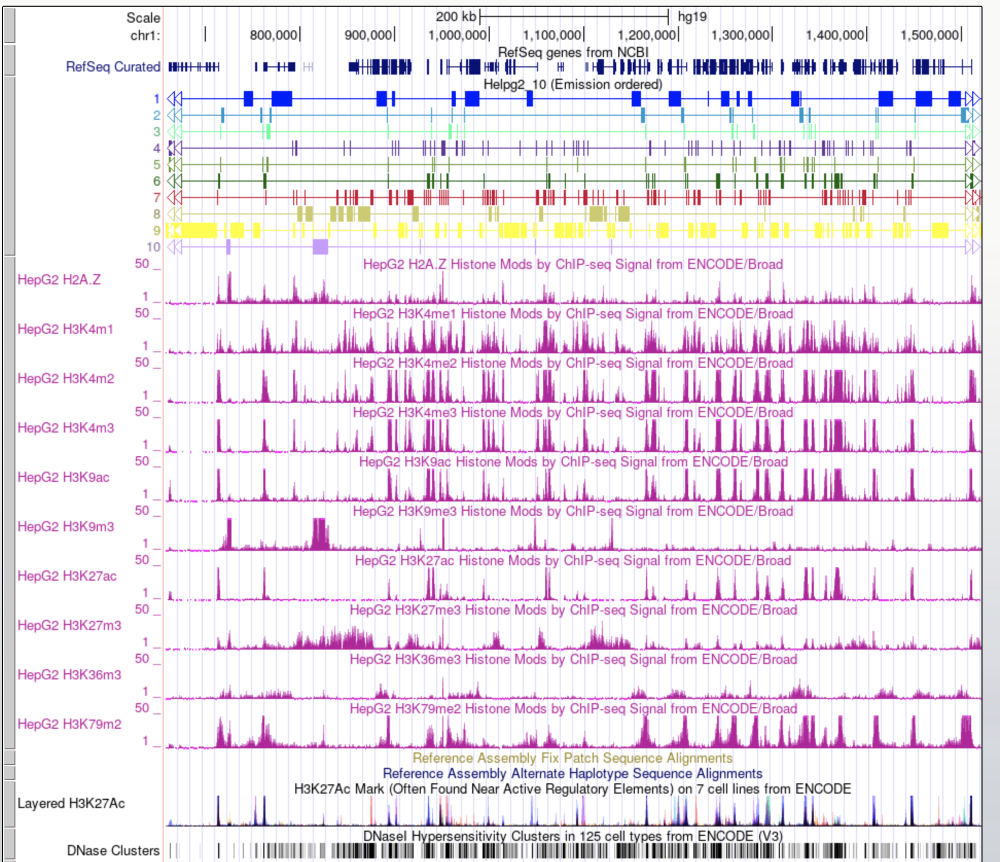 | 
| Видно, что 5 и 6 всегда идут рядом. 6 лучше всего ассоциируется с гистоновой меткой H3k4m3 и H3k9ac, а 5 с  H3k4m1. При этом 6 расположен в начале гена, поэтому скажем, что **6 - промоутер, 5 - энхансер**.|  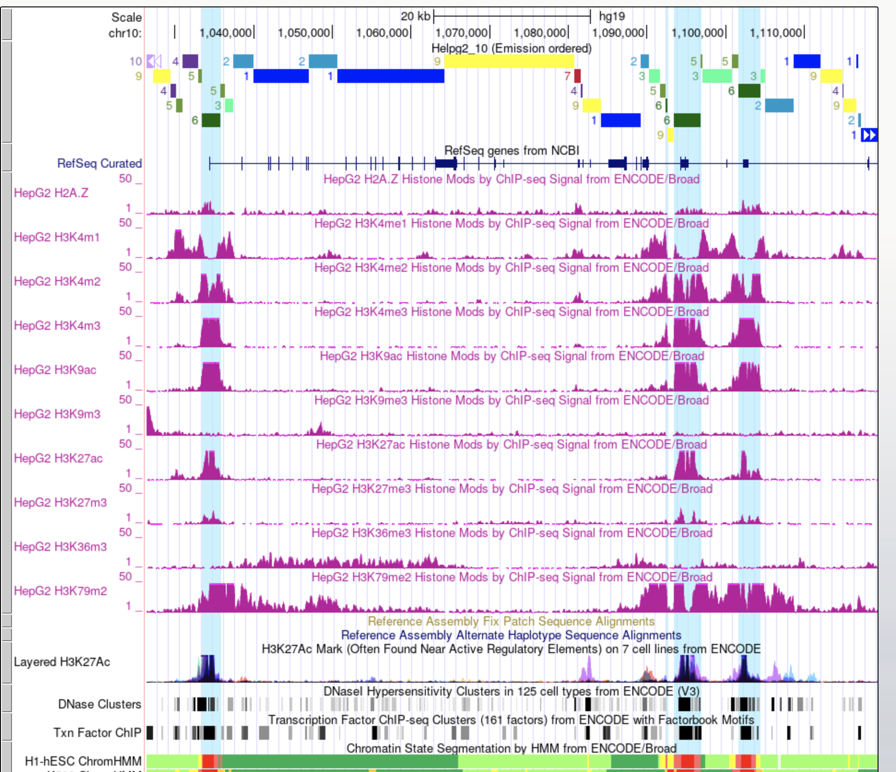 | 
|1, 2, 3 встречаются довольно редко и плохо ассоциированны с гистновыми метками. Логичней всего предположить, что **1 - это гетрохроматин, 2 - промоутер, 3 - инсулятор**, так как почти всегда распологается между промоутером и энхансером. |  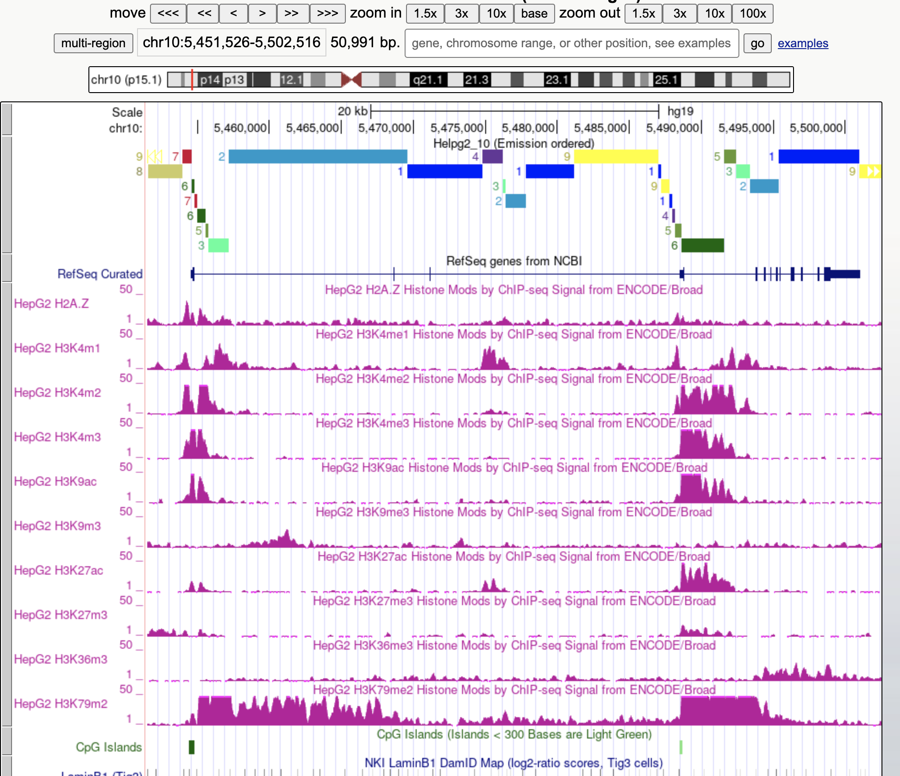 | 

### Бонус
Нам просто нужно заменить все числа, обозначающие группы в нашем *.bed* файле на нормальные названия.
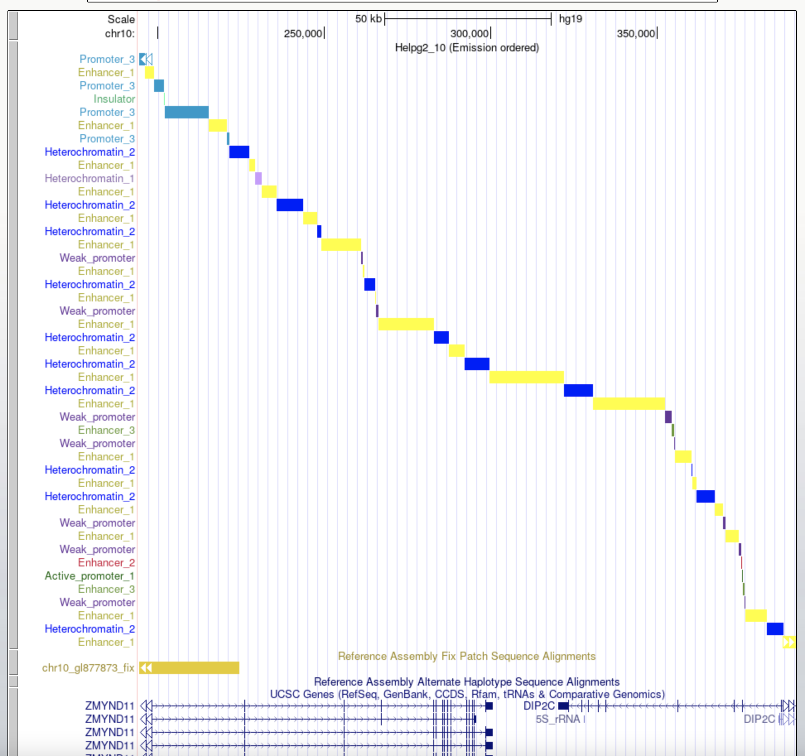

*P.C. Удалось закгрузить все кроме ...dense.bed из за его размера
